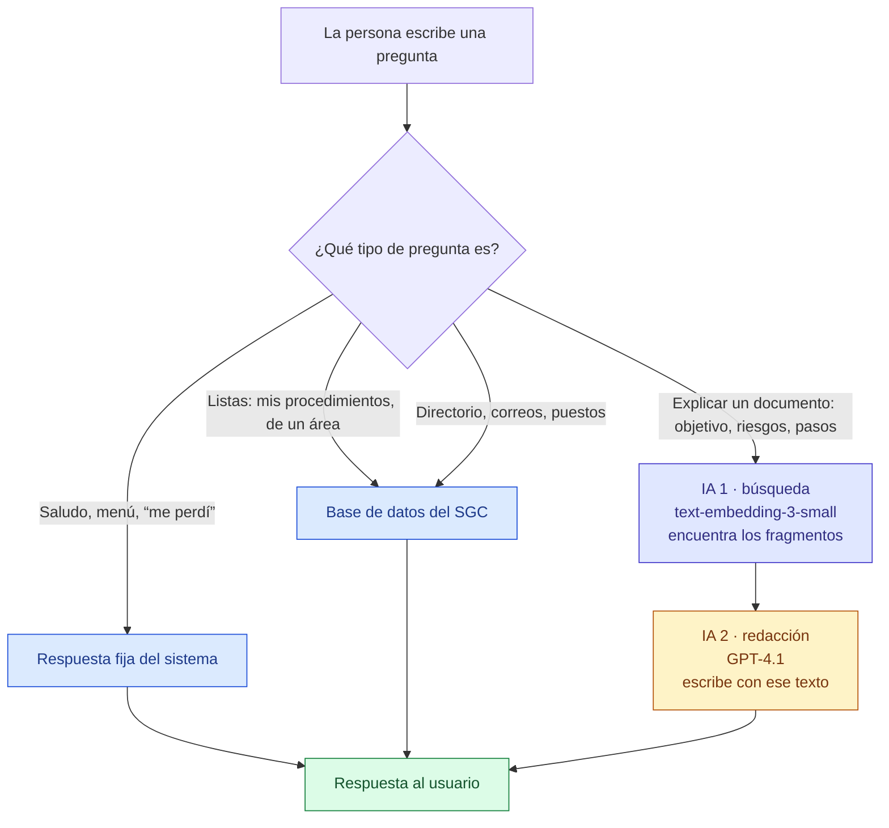
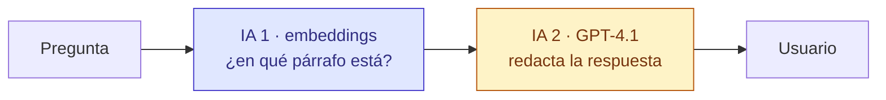
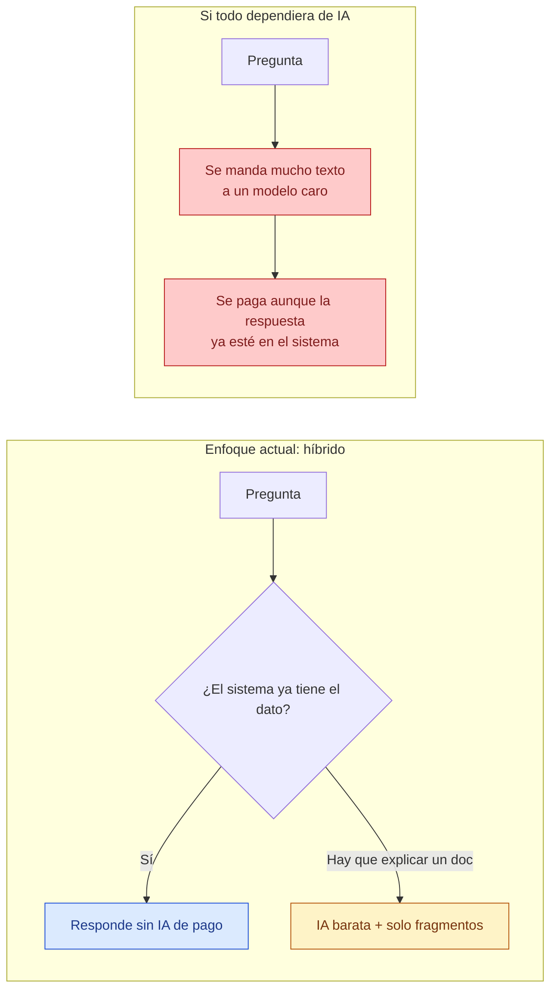
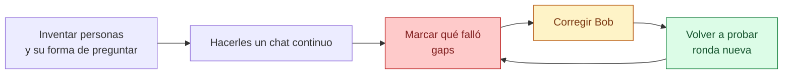

# Chatbot del SGC (Bob)

**Alcance estimado:** ~300 usuarios · el número de mensajes por persona **aún no se conoce**

---

## 1. En una frase

Bob es un asistente interno que responde con la información **oficial del Sistema de Gestión de Calidad**. No es un ChatGPT general: no inventa y no sirve para temas ajenos a la empresa.

---

## 2. Qué puede hacer

- Encontrar **procedimientos y políticas** (por folio, nombre, área o puesto).
- Explicar un documento: objetivo, alcance, responsable, pasos, riesgos.
- Consultar el **directorio**: quién ocupa un puesto, correos, unidades, directores.
- Mostrar **los documentos de tu puesto**.

Si la respuesta no está en el SGC, Bob lo dice. No la inventa.

---

## 3. Ventajas

| Ventaja | Qué significa en la práctica |
|---|---|
| Información oficial | Todos ven la versión publicada, no un PDF guardado en una computadora. |
| Más rápido | Se pregunta en lenguaje cotidiano en lugar de abrir varios documentos. |
| Mismo criterio | Las ~300 personas reciben la misma fuente de verdad. |
| Acotado al SGC | No se usa como chat personal (clima, noticias, etc.). Eso también baja el gasto. |
| Sigue funcionando sin IA | Listas, directorio y muchos datos salen del sistema, no de un servicio de pago. |

---

## 4. Cómo funciona (modo híbrido)

Hay dos caminos. **La IA de pago no entra en todas las preguntas.**

**Lectura del diagrama**

- Azul: **no se paga IA**. El sistema ya tiene el dato.
- Morado: IA de **búsqueda** (barata). No escribe; solo ubica el párrafo correcto.
- Amarillo: IA de **redacción**. Escribe la respuesta con ese texto.
- Verde: lo que ve la persona.

En pocas palabras: **la empresa ya tiene la información**. Las dos IAs solo entran cuando hay que **encontrar y explicar** un documento.

---

## 5. Qué IA usa (son dos, no una)

El chatbot usa **dos modelos de OpenAI**, cada uno para un trabajo distinto. No son dos “ChatGPT” compitiendo.

| Modelo | Para qué sirve | Analogía |
|---|---|---|
| **text-embedding-3-small** | Buscar | Un índice: “esta pregunta se parece a *este* párrafo del procedimiento”. No redacta. Es la más barata de las dos. |
| **GPT-4.1 mini** | Entender la pregunta | Reescribe “y eso?” con el hilo para buscar bien. Barata y rápida. |
| **GPT-4.1** | Redactar | Lee esos fragmentos y escribe la respuesta en español claro. No inventa fuera del texto que le dimos. Es la que el usuario percibe. |

| Pregunta frecuente | Respuesta simple |
|---|---|
| ¿Por qué dos y no una sola? | Una es buena para **encontrar**; la otra para **escribir**. Juntas evitan mandar el documento entero a la IA cara. |
| ¿Es “la IA más potente”? | No. Mini es un modelo **intermedio y económico**, no el premium de OpenAI. |
| ¿Por qué no una más cara? | Bob no debe “pensar el mundo”. Debe apoyarse en el SGC. |
| ¿La IA es la fuente de verdad? | No. La fuente es la base de datos y los documentos publicados. |

---

## 6. Cómo se controla el costo

La IA cobra por **cantidad de texto** que entra y que sale. Más texto = más dinero.

Por eso Bob está diseñado así:

1. **La mayoría de las preguntas no tocan la IA de pago** (directorio, listados, saludos).
2. **No se manda el documento completo**, solo los fragmentos que sirven para esa duda.
3. Se usan **dos modelos económicos** (búsqueda + mini), no el modelo premium de OpenAI.
4. Las **respuestas tienen tope** de tamaño: no escribe ensayos.
5. Hay **límite de consultas** por usuario (evita abusos o bucles).
6. Se **reutiliza** lo ya calculado cuando la pregunta se parece a otra anterior.
7. **No responde temas ajenos** al SGC.

---

## 7. Qué pasaría si todo pasara por IA

Esta es la diferencia que importa para la decisión.

**Si dependiéramos de la IA para toda la información:**

- Se pagaría **aunque la respuesta ya esté en el sistema** (“quién ocupa…”, listas, saludos).
- Cada mensaje sería más caro: documento completo + modelo más potente.
- El gasto **no se puede fijar de antemano**: no sabemos cuántos mensajes manda cada persona.
- A ~300 usuarios, un grupo que lo use mucho (repreguntar, copiar, probar) puede multiplicar el consumo en **días**, no en meses.
- Sube el riesgo de respuestas **inventadas o desactualizadas**, porque la IA dejaría de ser un redactador y pasaría a “adivinar”.

### Números solo para dimensionar (no son una factura)

Un modelo grande puede costar **varias veces más** que el mini + la búsqueda. Si además se manda el documento entero, una pregunta puede salir **decenas de veces más cara**.

| Uso mensual ilustrativo · 300 personas | Enfoque híbrido actual | Todo por IA grande y documentos completos |
|---|---|---|
| Uso bajo: ~5 mensajes por persona al día | Algunos dólares al mes | Cientos de dólares al mes |
| Uso alto: ~20 mensajes por persona al día | Sigue en un rango bajo / controlable | Miles de dólares al mes |

El segundo escenario es el riesgo: **el volumen de mensajes es desconocido**. Sin el modo híbrido, el costo queda atado al hábito de cada usuario, no al valor de la pregunta.

---

## 8. Qué ya se probó (usuarios emulados y búsqueda de gaps)

Antes de una demo con gente real se hicieron **6 rondas** de prueba. No fueron preguntas “bonitas”: se emularon personas de obra, calidad, compras, TI, jurídico, etc., con tono de WhatsApp, typos, sin folio, y también perfiles expertos. El objetivo era **encontrar huecos (gaps)** y corregirlos.

**En números**

- **~6,600 preguntas** diseñadas en total (las rondas se archivan; no se borra el historial).
- **~1,470 interacciones** corridas en vivo contra el chatbot real (muestras de cada ronda).
- **0 veces** se cayó o se corrompió el servicio en esas corridas.

### Cómo evolucionó

| Ronda | Qué se emuló | Resultado | Gaps que se encontraron | Qué se corrigió después |
|---|---|---|---|---|
| **1–2** | 500 preguntas cada una (catálogo inicial) | Se armó el set y el método de calificación | Base para medir | — |
| **3** | 500 nuevas + smoke de 23 casos reales | **91.3%** OK · 0 caídas · veredicto: *piloto, no apertura total* | Sueldo+puesto se iba a un PDF; typos (campamentos) a doc vecino | Off-topic sensible gana primero; si no hay doc publicado, no inventar otro |
| **4** | **50 usuarios básicos** × 50 preguntas (obra, conta, RH, compras…) · 400 chats en vivo | **100%** estable · calidad de novato **7/10** | Tardaba (~10 s a veces); “me perdí” abría menú vacío; “necesito algo de X” abría un PDF al azar; “en bullets” cambiaba de documento | Recuperar el tema; aclarar antes de abrir PDF; directorio para “quién me ayuda”; formato = mismo doc; aviso “Buscando…” |
| **5** | **100 personas** (50 básicos + 50 expertos) · 800 chats en vivo | **98.4%** OK · **8.5/10** · más rápido (4.3 s → 2.7 s) | Expertos: “en bullets” sin documento en foco (13 fallas); a veces “lista los directores” iba a IA; comparar 2 procedimientos solo veía uno | Reanclar el último doc; confirmar “¿Te refieres a…?”; directores desde BD; ruta de comparar + botones |
| **6** | **30 personas** con nivel al azar (básico / intermedio / experto) · 240 chats en vivo | **99.6%** OK · **~9.2/10** · expertos **100%** | 1 falla de “necesito algo de cierre” con un PDF ya abierto | El vago suelta el foco y **pide confirmación** |

### Qué mejoró, en lenguaje de junta

| Problema que veía un usuario | Ronda 4 | Ronda 6 |
|---|---|---|
| El chat se cae | No | No |
| “Me perdí / volvamos” y se pierde el tema | A veces menú vacío (16 casos) | Recupera el último tema |
| “Necesito algo de facturas / cierre” y abre un PDF incorrecto | Frecuente | Pide confirmación (“¿Te refieres a…?”) |
| “En bullets” y cambia de procedimiento | Sí pasaba | Ya no (0 en la muestra) |
| “Lista los directores” | A veces iba a IA | Sale del directorio, sin IA |
| Comparar dos procedimientos | Respondía de uno solo | Avisa y ofrece elegir con botones |
| Tiempo de respuesta | Promedio 4.3 s · pico 32 s | Promedio 2.6 s · p95 6.9 s |

### Qué todavía no sustituye una demo real

Las pruebas emulan bien **cómo pregunta la gente** y sirven para cazar gaps. No miden aún:

- Cuántos mensajes manda cada persona al día (eso define el costo).
- Si el puesto del usuario en login está bien ligado (“mis procedimientos”).
- La sensación en obra / oficina con red real (algunos folios siguen en 11–15 s al abrir).

Por eso el siguiente paso sigue siendo **usuarios reales**: el laboratorio ya subió la calidad; la demo dirá el uso y el costo.

---

## 9. Por qué una primera demo con usuarios reales

Hoy no sabemos cuánto se va a usar. La demo no es solo para “ver si gusta”: es para **medir y ajustar** con gente de verdad, encima de lo que ya se corrigió en laboratorio.

Con usuarios reales se puede:

- Contar **cuántas preguntas** hace cada perfil (obra, calidad, corporativo, etc.).
- Ver **cuáles sí necesitan IA** y cuáles el sistema ya resuelve solo.
- Comprobar si Bob encuentra el documento correcto y si la gente lo entiende.
- Bajar todavía más las llamadas de pago y mejorar la redacción donde sí se usa IA.
- Tener un **costo real** antes de abrirlo a las 300 personas.

---

## 10. Puntos importantes

1. Bob consulta el **SGC**, no internet ni conocimiento general.
2. La IA se usa **solo para explicar documentos**, no para todo.
3. Eso es lo que mantiene el costo **predecible y bajo**.
4. Mandar todo a IA, con ~300 personas y uso desconocido, **inflaría el gasto sin mejorar la calidad**.
5. Ya se probaron **6 rondas emulando usuarios** y se fueron cerrando gaps (de ~7/10 a ~9.2/10; 0 caídas).
6. La demo con usuarios reales permite **seguir el uso, cuidar el costo y seguir mejorando Bob con evidencia**.

---

*Los montos de la sección 7 son ejemplos de escala, no una cotización. El costo real se conocerá con la demo. El detalle técnico de cada ronda está en `tests/bob_qa/`.*
